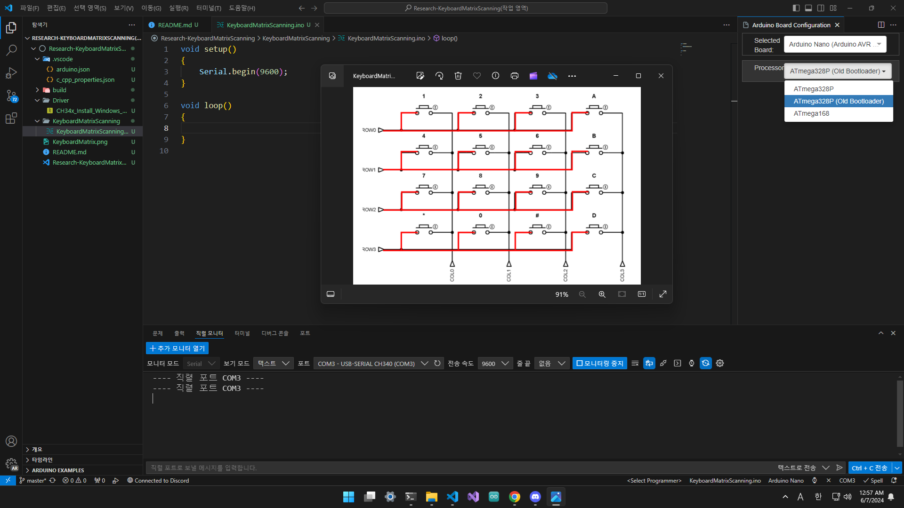

# 💻 Research-KeyboardMatrixScanning

## Preview

## Introduction

> 아두이노와 택트 스위치를 사용해 버튼 메트릭스를 설계하고 [키보드 메트릭스](./KeyboardMatrix.png) 스케닝을 구현해 보자.

## Requirements

> Arduino nano(Use [CH32x driver](./Driver/CH34x_Install_Windows_v3_4.zip)) x 1  
> Tact switch x 16  